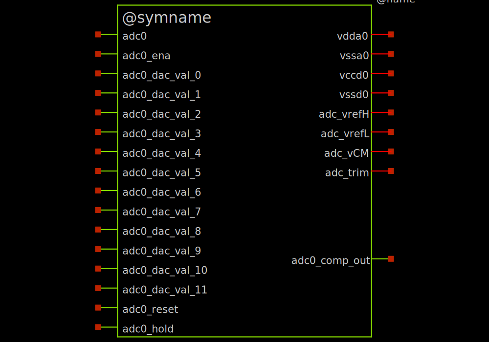
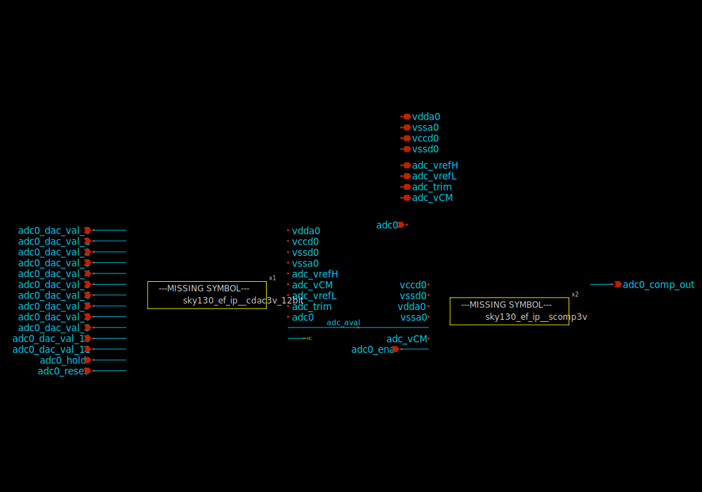
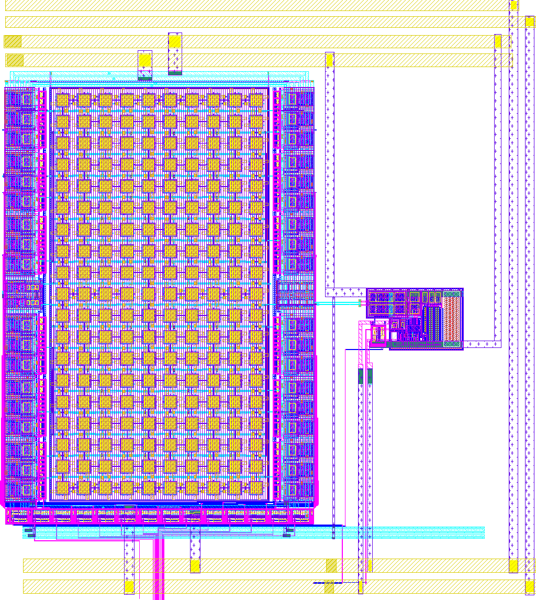
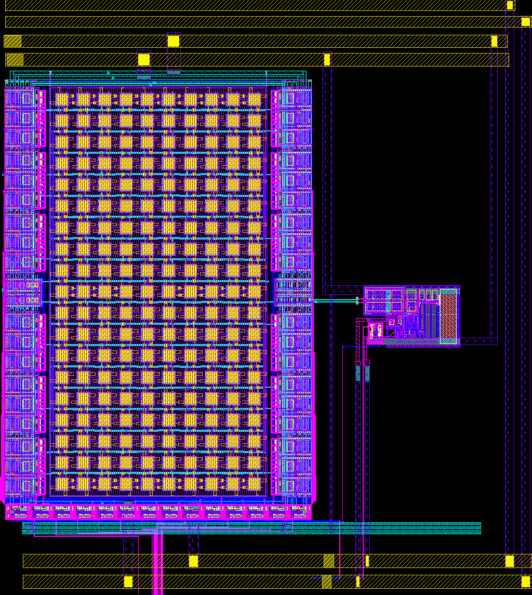

# sky130_ef_ip__adc3v_12bit

- Description: 12-bit ADC using other analog component repositories for the sample & hold, DAC, and comparator.
- PDK: sky130A

## Authorship

- Designer: Tim Edwards
- Company: Efabless Corporation
- Created: na
- License: Apache 2.0
- Last modified: None

## Pins

## Default Conditions

## Symbol

## Schematic

## Layout

